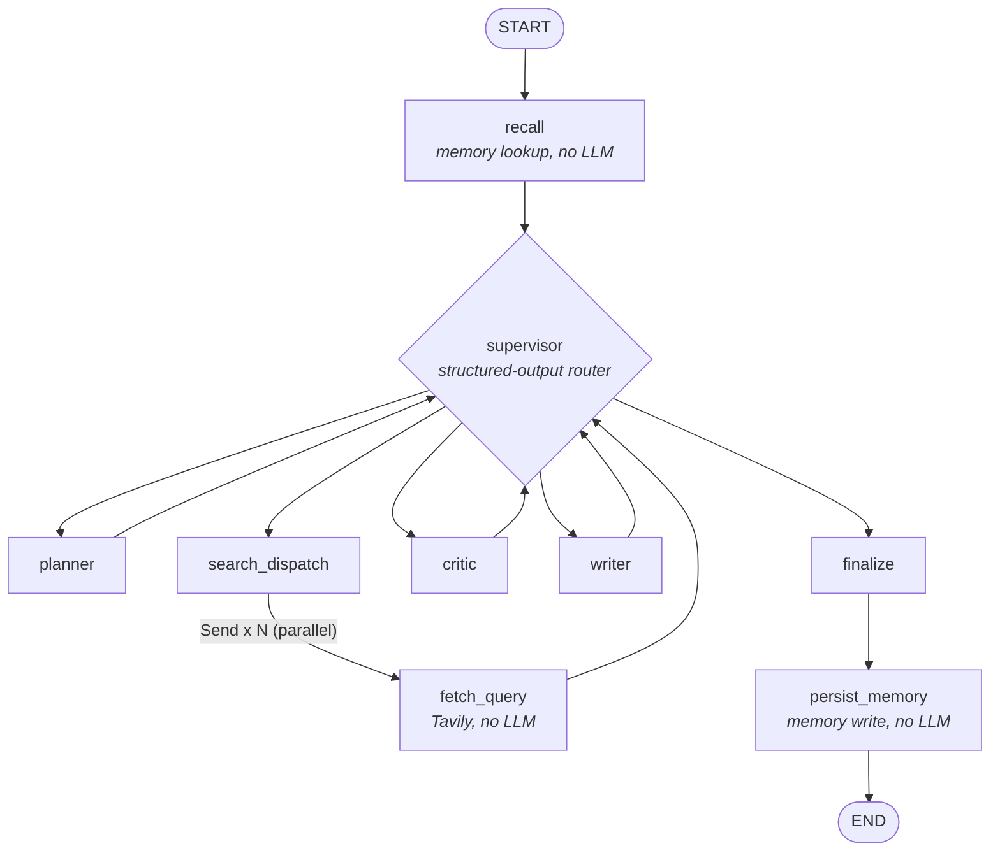

# LangGraph Multi-Agent Research System

A supervisor-routed multi-agent research system built on **LangGraph**, running a **local 9B model on a laptop GPU (RTX 3070, 8GB VRAM)** with cross-session memory.

The design goal was architecture that is honest about what it can do on the available hardware.

---

## Highlights

- **Genuine multi-agent control flow.** A supervisor makes a fresh, LLM-driven routing decision (via structured output) after every worker finishes. Control flow is decided at runtime, not hardcoded as a chain.
- **Deliberate context isolation.** The critic never sees raw sources; the writer never sees the critic's internal reasoning. Splitting into agents is only worth it if their contexts are actually separated.
- **Parallelism only where it is real.** With one GPU, LLM calls queue rather than parallelize, so the only fan-out is at the network I/O layer: parallel Tavily searches via LangGraph's `Send`.
- **Cross-session long-term memory.** Past sessions are embedded (CPU-only `all-MiniLM-L6-v2`) and stored in a persistent Chroma store, then recalled on similar future questions.
- **Four layers of runaway-loop protection**, added after hitting a real supervisor-looping bug (details below).
- **Resilient to a real local-model failure mode.** Handles thinking-capable Qwen builds that write output into a `thinking` field and leave `content` empty.
- **Fits in 8GB VRAM.** Model, context size, and embedding placement were chosen around a hard memory budget.

---

## Architecture



| Node | LLM? | Sees | Responsibility |
|---|---|---|---|
| `recall` | No (CPU embed) | task | Looks up similar past sessions from long-term memory |
| `supervisor` | Yes, structured output | full state | Decides which agent acts next |
| `planner` | Yes | task, prior critique, recalled context | Generates and revises search queries |
| `search_dispatch` + `fetch_query` ×N | No | one query each | `Send`-based parallel Tavily calls, merged via `operator.add` |
| `writer` | Yes | task, all search results, recalled context | Drafts a cited answer; the only agent that sees raw results |
| `critic` | Yes | task and draft only | Judges sufficiency and gives targeted feedback |
| `finalize` | No | draft, sources | Appends the source list and produces `final_answer` |
| `persist_memory` | No (CPU embed) | task, final answer | Writes the session to long-term memory |

`recall` and `persist_memory` are plain fixed edges rather than supervisor-routed. There is nothing ambiguous about "check memory first, save memory last," so spending an LLM decision on it would be architecture theater.

---

## Design decisions

### Hardware-honest parallelism
On a single 8GB GPU, concurrent requests to the same Ollama model queue instead of running in parallel. So the system does **not** pretend to parallelize agents. The only fan-out is Tavily network I/O, where parallelism is real.

### Memory without stealing VRAM
Embeddings run on **CPU** on purpose, outside Ollama, so they never compete with the 9B model for VRAM or force Ollama to swap models in and out. `qwen3.5:9b` at its default q4_K_M quant is ~6.6GB and fits alongside `num_ctx=8192`.

### Long-term memory vs. checkpointing
`memory.py` (cross-session semantic recall) and the LangGraph checkpointer (`MemorySaver`, for resuming a run) solve different problems and are kept separate.

---

## Guardrails against runaway routing

These were built in response to a bug hit for real: the supervisor cycled `writer <-> critic` without ever revisiting `planner`, so an iteration cap that only counted planner visits never fired.

| Layer | Where | What it does |
|---|---|---|
| 1. `validate_settings()` | `config.py` | Catches a missing or placeholder Tavily key at startup |
| 2. `TavilyAuthError` | `tools.py` | Fails the run fast on auth errors instead of grinding through hops on garbage `[search error]` data |
| 3. `total_hops` | `state.py`, `agents/supervisor.py` | Increments on **every** supervisor visit regardless of path; the real bound on worst-case routing |
| 4. `recursion_limit` | `main.py` | LangGraph's own step backstop, set explicitly. Should never fire; if it does, `main.py` treats it as a bug signal |

Defaults: `MAX_ITERATIONS=2`, `MAX_TOTAL_HOPS=10`, `RECURSION_LIMIT=30`.

---

## Engineering notes: bugs found and fixed

- **Empty `content` from thinking models.** Qwen3.x builds can put their whole answer in `thinking` / `reasoning_content` and leave `content` empty (a known open Ollama issue, worse on long prompts). `llm.py::response_text()` falls back to those fields and logs a `[warn]`; `writer_node` has a last-resort guard so a draft is never silently empty.
- **Delta-vs-full-state streaming bug.** `astream()` yields each node's *delta*, not the merged state. The CLI was tracking "whatever ran last," which was `persist_memory`'s empty `{}`, discarding the real answer. Fixed by capturing `final_answer` explicitly from the `finalize` node.
- **Wrong model tag.** `qwen3.5-instruct:9b` is not an official Ollama tag. The repo defaults to the official `qwen3.5:9b` and relies on the fallback above.

---

## Project structure

```
research_agent/
  config.py             Settings, .env loading, validate_settings()
  state.py              ResearchState TypedDict, reducers for parallel merge
  llm.py                Shared ChatOllama instances + response_text() fallback
  tools.py              async tavily_search(), TavilyAuthError
  memory.py             CPU embeddings + persistent Chroma store
  agents/
    recall.py           Memory lookup (no LLM)
    supervisor.py       Routing decision (structured output) + guardrails
    planner.py          Query generation/revision
    search.py           Send-based parallel fan-out (no LLM)
    writer.py           Cited draft synthesis
    critic.py           Draft sufficiency judgment
    finalize.py         Terminal formatting (no LLM)
    persist_memory.py   Memory write (no LLM)
  graph.py              StateGraph wiring, conditional routing, MemorySaver
  main.py               CLI entry point, streams node-by-node via astream()
```

---

## Tech stack

| Concern | Choice |
|---|---|
| Orchestration | LangGraph (`StateGraph`, `Send`, conditional routing, `MemorySaver`) |
| LLM | Local `qwen3.5:9b` via Ollama |
| Search | Tavily API (async) |
| Embeddings | `sentence-transformers/all-MiniLM-L6-v2` (CPU) |
| Vector store | Chroma, local persistent (`./.memory`) |
| Config | `python-dotenv` |

---

## Getting started

**Prerequisites:** Python 3.10+, [Ollama](https://ollama.com), a [Tavily](https://tavily.com) API key. An 8GB GPU is enough.

```bash
git clone <your-repo-url>
cd research_agent

pip install -r requirements.txt

ollama pull qwen3.5:9b

cp .env.example .env
# edit .env and set your Tavily key (starts with tvly-)

python main.py "your research question"
```

Progress streams node by node, so you can watch the supervisor's routing decisions as they happen.

---

## Status and known limitations

- **Parallel speedup is not yet benchmarked.** `Send` fan-out is designed to parallelize Tavily calls, but a timed comparison against a sequential baseline has not been run yet.
- **Recall threshold is untuned.** `RECALL_SIMILARITY_THRESHOLD=0.6` is an initial guess, pending checks against real near-duplicate queries.
- **Staleness handling is untested end-to-end.** The writer frames recalled context as possibly stale, but this has not yet been verified on a time-sensitive question asked twice.
- **Single-GPU by design.** The writer is a single agent because parallel writers would just queue on this hardware.

## Roadmap

- [ ] `human_review` interrupt node between critic and finalize
- [ ] Persistent checkpointer to replace `MemorySaver` (resume interrupted runs)
- [ ] Benchmark parallel vs. sequential search and record the numbers here
- [ ] Tune the recall similarity threshold
- [ ] On larger hardware: parallel per-source-cluster writers via agent-level `Send`

---

## License

Add a license of your choice (MIT is a common default for portfolio projects).
